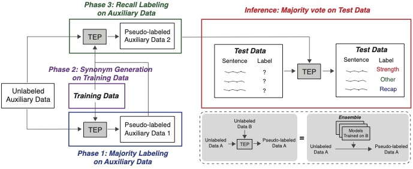

### This subfolder explains the full condition.

Full condtion is trained with [train_inputs_full.json](train_inputs_full.json), which excludes the [val_inputs.json](../public_dat/val_inputs.json) from [train_inputs.json](../public_dat/train_inputs.json). The overview of training process can be viewed at below.

#### Phase 1

5 RoBERTa-base classifiers are trained identically except their random seeds with [train_inputs_full.json](train_inputs_full.json).

By providing model path to 5 classifiers, run `python full_phase1.py [model_path]` to majority label and obtain the labels. We also include predicted labels using `majority labeling` and `consensus labeling` for `F1000raw` and `F1000raw+ARR-22`.

[f1000_majority_train_inputs_full.json](phase1/f1000_majority_train_inputs_full.json) is the auxiliary data we used.

#### Phase 2

[train_inputs_full.json](train_inputs_full.json) is augmented via synonym generation using NLPaug package. The augmented dataset can be found at [train_nlpaug.json](phase2/train_nlpaug.json). 

We train RoBERTa-base with this dataset for three different conditions: 20 epochs with no callback and 30, 50 epochs with early stopping at 4 val loss drops. We save at most 5 best models and select the best to use.

Code for synonym augmentation can be viewed at [train_augment.ipynb](phase2/train_augment.ipynb).

#### Phase 3

The labeled auxiliary data and augemented train data are jointly recall labeled in this phase. 

Best recall for all pragmatic tags except `Other` are obtained with Phase 2. 

Labels generated by each model are saved in [tags](phase3/tags). 

By running [full_phase3.py](phase3/full_phase3.py), [f1000_recall_labeled.json](phase3/f1000_recall_labeled.json) is obtained.

#### Inference

We use 5 models for majority labeling test data under full condition. Learning rate and batch size for all models are 2e-5 and 8 respectively, except 3 which batch size is 16.

1. Recall labeled data from Phase 3, trained over 30 epochs
2. Recall labeled data from Phase 3, trained over 50 epochs
3. Majority labeled data from Phase 1, trained over 30 epochs
4. Model trained with synthetic augmented data from Phase 2, trained over 30 epochs
5. Recall labeled model using majority labeling from Phase 1, consensus labeling using F1000+ARR dataset, retrieve-based labeling, and initial RoBERTa classifier. We note that their performance on validation dataset weren't such competitive than other models, thus used here only once. Training script for these models are omitted.

One auxiliary model is trained using [train_inputs.json](../public_dat/train_inputs.json). This model is utilized during majority labeling only for full condition, which doesn't include secret domain.

The majority labeling process is in [full_inference.py](inference/full_inference.py). The labels from aforementioned models are in [tags](inference/tags).

[submission_full.zip](submission_full.zip) contains our best model's test data label.

[submission_final_full.zip](submission_final_zero.zip) contains our best model's test data label, including the secret domain.

We achieve `0.839` F1-mean score and `0.824` including secret domain.
